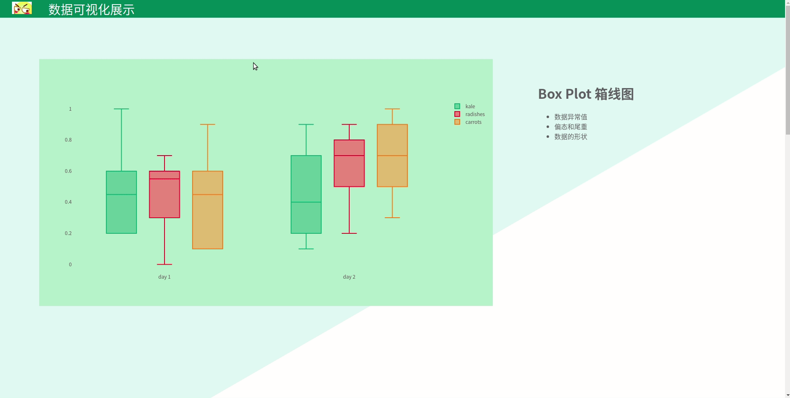

# Three.js 学习(2):  滚动效果+数据展示

看到了react-three-fiber作者展示的作品https://codesandbox.io/embed/r3f-moksha-f1ixt，心声敬佩，大呼卧草，就想能不能用这个套子做一个数据展示的东
西，于是搞起。

先看一下效果，虽然写的跟大佬的比就是shi，但是还是记录一下知识点：

+ 图表部分使用的是plotly



## 1. 滚动实现

+ 通过滚动栏控制position的y
+ 通过offset和factor来控制各个block的位置，以及位置变更方向

```javascript
function Block({ children, offset, factor, ...props }) {
    const { offset: parentOffset, sectionHeight } = useBlock();
    const ref = useRef();
    offset = offset !== undefined ? offset : parentOffset;
    useFrame(() => {
        const curY = ref.current.position.y;
        const curTop = state.top.current;
        ref.current.position.y = lerp(curY, (curTop / state.zoom) * factor, 0.1)
    });
    return (
        <offsetContext.Provider value={offset}>
            <group {...props} position={[0, -sectionHeight * offset * factor, 0]}>
                <group ref={ref}>{children}</group>
            </group>
        </offsetContext.Provider>
    )
}
```

## 2. 添加html元素

+ 通过使用Dom组建添加html元素，文字等

```javascript
<Dom style={{width: pixelWidth / (mobile ? 1 : 2), textAlign: "left"}}
     position={[contentMaxWidth*alignDirection / 4- alignRight*2, contentMaxWidth / 3, 1]}>
    {getGraph(graphNum)}
</Dom>
```

## 3. lerp函数

+ 为了让过渡更加平滑使用lerp函数，在两个过程中插入一些过渡值

```javascript
ref.current.position.y = lerp(curY, (curTop / state.zoom) * factor, 0.1)
```

## 4. Suspense异步加载

+ Suspense为react自带功能，激活lazy加载，如果为加载完成 会触发`fallback`

```javascript
<Suspense fallback={<Dom center className="loading" children="Loading..." />}>
  <Pages />
  {/*<Diamonds />*/}
  <Startup />
</Suspense>
```

## 5.左右切换

+ 根据传入left做到每一页左右可以互换
+ 通过`contentMaxWidth`指定`positon`的x轴位置

```javascript
<group position={[0, 0, 0]}>
  <Dom style={{width: pixelWidth / (mobile ? 1 : 2), textAlign: "left"}}
       position={[contentMaxWidth*alignDirection / 4- alignRight*2, contentMaxWidth / 3, 1]}>
      {getGraph(graphNum)}
  </Dom>
  <Dom style={{width: pixelWidth / (mobile ? 1 : 2), textAlign: "left"}}
       position={[-contentMaxWidth*alignDirection / 2 - alignRight*0.8 , contentMaxWidth / 10 * 3, 1]}
  >
    {getList(getInfo(graphNum))}
  </Dom>
  {children}
</group>
```

## 6. 选择可视化图形

+ 通过传入图形id进行图形选取

```javascript
const getGraph = (graphNum) => {
  if (graphNum === 3) return (<Graph3/>);
  else if (graphNum === 2) return (<Graph2/>);
  else return (<Graph1/>);
};
```

## 7. 完成list

+ 通过输入列表数据完成list

```javascript
const getList = ({title, lines}) => {
  const lis = lines.map(line=>(<li>{line}</li>));
  return (
    <>
      <h1> {title} </h1>
      <ul>
        {lis}
      </ul>
    </>
  )
};
```

## 8.演示代码

github